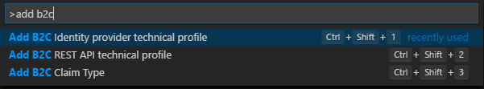

# Azure AD B2C extension

The Azure AD B2C extension for VS Code lets you quickly navigate through Azure AD B2C custom policy. Create new elements, such as: technical profiles and claim definition

## Azure AD B2C Custom policy Features
### Custom policy navigator

### Go to definition and find all references

### Adding XML elements

## Disclaimer
The extension is open-source code, publish in GitHub. The extension is not part of Azure AD B2C product and it's not supported under any Microsoft standard support program or service. The extension is provided AS IS without warranty of any kind. 
